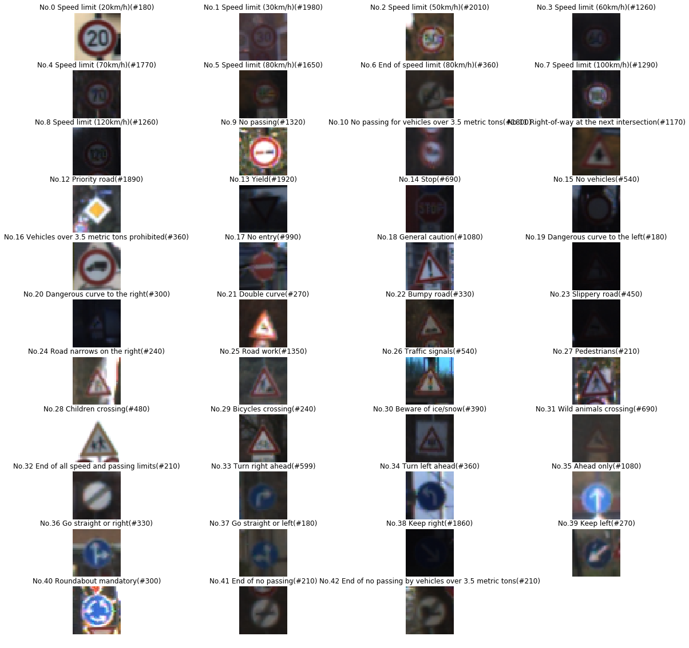
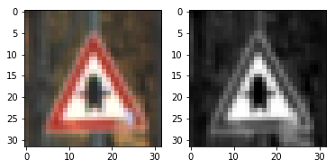
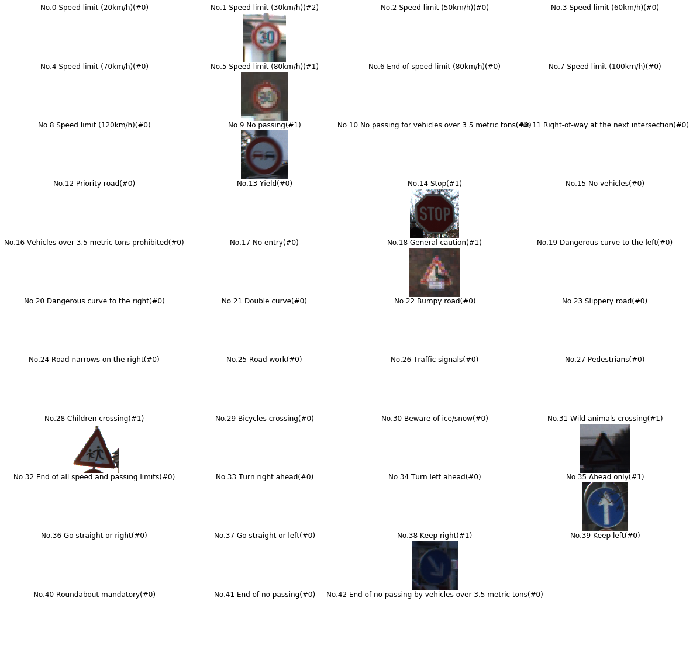
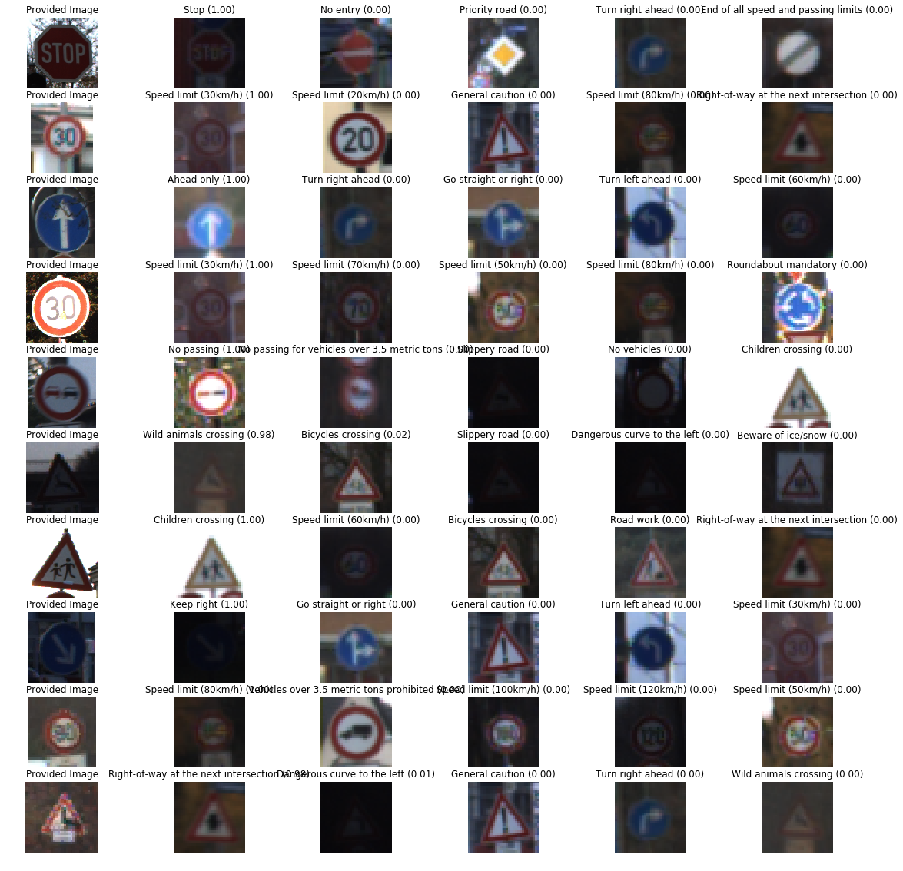

# Term 1 Project 2 - Traffic Sign Recognition

The goal of this project is building a convolutional neural network to recognize traffic sign.

The steps of this project are the following:
* Load the data set (see below for links to the project data set)
* Explore, summarize and visualize the data set
* Design, train and test a model architecture
* Use the model to make predictions on new images
* Analyze the softmax probabilities of the new images
* Summarize the results with a written report

## Rubric Points
### Files Submitted
This project includes
* notebook - P2.ipynb
* exported HTML version of notebook - P2.html
* write up - README.md

### Data Set Summary & Exploration

#### 1. Provide a basic summary of the data set. In the code, the analysis should be done using python, numpy and/or pandas methods rather than hardcoding results manually.

* Number of training examples = 34799
* Number of valid examples= 4410
* Number of testing examples = 12630
* Image data shape = (32, 32, 3)
* Number of classes = 43

#### 2. Include an exploratory visualization of the dataset.

Here is an exploratory visualization of the data set. It shows how many classes are in the dataset with example counts and sample images.

### Design and Test a Model Architecture

#### 1. Describe how you preprocessed the image data. What techniques were chosen and why did you choose these techniques? Consider including images showing the output of each preprocessing technique. Pre-processing refers to techniques such as converting to grayscale, normalization, etc. (OPTIONAL: As described in the "Stand Out Suggestions" part of the rubric, if you generated additional data for training, describe why you decided to generate additional data, how you generated the data, and provide example images of the additional data. Then describe the characteristics of the augmented training set like number of images in the set, number of images for each class, etc.)

As a first step, I decided to resize and convert the images to grayscale then normalize it because my CNN requires a fixed size of input and removing channels help to simplify my CNN.

Here is an example of a traffic sign image before and after preprocessing.

#### 2. Describe what your final model architecture looks like including model type, layers, layer sizes, connectivity, etc.) Consider including a diagram and/or table describing the final model.

My final model consisted of the following layers:

| Layer         		|     Description	        					| 
|:---------------------:|:---------------------------------------------:| 
| Input         		| 32x32x1 image   							| 
| Convolution 5x5     	| 1x1 stride, valid padding, outputs 28x28x12 	|
| RELU6					|			|
| Max pooling	      	| 2x2 stride,  outputs 14x14x12 				|
| Convolution 5x5	    | 1x1 stride, valid padding, outputs 10x10x24     |
| RELU6 				|		    |
| Max pooling	      	| 2x2 stride,  valid padding, outputs outputs 5x5x24|
| flatten + drop out    | outputs 600|
| Fully connected   	| outputs 344|
| RELU6 				|		     |
| Fully connected   	| outputs 172|
| RELU6 				|		     |
| Fully connected   	| outputs 86 |
| RELU6 				|		     |
| Fully connected   	| outputs 43 |

#### 3. Describe how you trained your model. The discussion can include the type of optimizer, the batch size, number of epochs and any hyperparameters such as learning rate.

To train the model, I used an following hyperparameters with Adam Optimizer

* batch_size = 128
* epoch = 50
* learning rate = 0.001

#### 4. Describe the approach taken for finding a solution and getting the validation set accuracy to be at least 0.93. Include in the discussion the results on the training, validation and test sets and where in the code these were calculated. Your approach may have been an iterative process, in which case, outline the steps you took to get to the final solution and why you chose those steps. Perhaps your solution involved an already well known implementation or architecture. In this case, discuss why you think the architecture is suitable for the current problem.

My final model results were:
* validation set accuracy of 0.950
* test set accuracy of 0.935

If an iterative approach was chosen:
* What was the first architecture that was tried and why was it chosen?

I first adapted the LeNet architecture as it is simple yet efficient on handwritings recognizing.

* What were some problems with the initial architecture?

The model was underfitting.

* How was the architecture adjusted and why was it adjusted? Typical adjustments could include choosing a different model architecture, adding or taking away layers (pooling, dropout, convolution, etc), using an activation function or changing the activation function. One common justification for adjusting an architecture would be due to overfitting or underfitting. A high accuracy on the training set but low accuracy on the validation set indicates over fitting; a low accuracy on both sets indicates under fitting.

As the model was underfitting, I added more complexity into it such as drop out layer, one extra fully connected layer.

* Which parameters were tuned? How were they adjusted and why?

Convolution layers output depth. I was trying to add more complexity. However, the number was defined in a backward order. As the final number of classes is 43, I double it for each linear layer, then I will have 600 output from the the second convolution layer then I use the number to adjust output depth from conv layers.

* What are some of the important design choices and why were they chosen? For example, why might a convolution layer work well with this problem? How might a dropout layer help with creating a successful model?

Dropout help to prevent overfitting when I was trying to add more complexity into the model.

### Test a Model on New Images

#### 1. Choose five German traffic signs found on the web and provide them in the report. For each image, discuss what quality or qualities might be difficult to classify.

Here are the German traffic signs that I found on the web:

#### 2. Discuss the model's predictions on these new traffic signs and compare the results to predicting on the test set. At a minimum, discuss what the predictions were, the accuracy on these new predictions, and compare the accuracy to the accuracy on the test set (OPTIONAL: Discuss the results in more detail as described in the "Stand Out Suggestions" part of the rubric).

The model was able to correctly guess 9 of the 10 traffic signs, which gives an accuracy of 90%. This compares favorably to the accuracy on the test set of 93.5%

#### 3. Describe how certain the model is when predicting on each of the five new images by looking at the softmax probabilities for each prediction. Provide the top 5 softmax probabilities for each image along with the sign type of each probability. (OPTIONAL: as described in the "Stand Out Suggestions" part of the rubric, visualizations can also be provided such as bar charts)

The code for making predictions on my final model is located in the 104th cell of the Ipython notebook.

The top five soft max probabilities were

