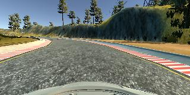
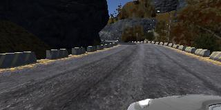
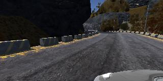
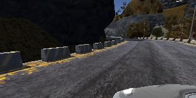
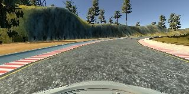

# Term 1 Project 3 - Behavioral Cloning

The goals of this project is training a convolution neural network to control steering by providing user driving behavior data.

The steps of this project are the following:
* Use the simulator to collect data of good driving behavior
* Build, a convolution neural network in Keras that predicts steering angles from images
* Train and validate the model with a training and validation set
* Test that the model successfully drives around track one without leaving the road
* Summarize the results with a written report

## Rubric Points
### Files Submitted & Code Quality

#### 1. Submission includes all required files and can be used to run the simulator in autonomous mode

My project includes the following files:
* model.py containing the script to create and train the model
* drive.py for driving the car in autonomous mode
* model.h5 containing a trained convolution neural network
* video.mp4 is video recording of the vehicle driving autonomously around the track
* README.md containing a write up

#### 2. Submission includes functional code
Using the Udacity provided simulator and my drive.py file, the car can be driven autonomously around the track by executing 
```sh
python drive.py model.h5
```

#### 3. Submission code is usable and readable

The model.py file contains the code for training and saving the convolution neural network. The file shows the pipeline I used for training and validating the model, and it contains comments to explain how the code works.

### Model Architecture and Training Strategy

#### 1. An appropriate model architecture has been employed

My model follows Nvidia's Dave 2 architecture. I have added three dropout layers to prevent overfitting as I don't as much training data as their team.

Architecture Summary
_________________________________________________________________
| Layer (type)              | Output Shape            | Param # |
|:-------------------------:|:-----------------------:|:-------:|
| cropping2d_1 (Cropping2D) | (None, 90, 320, 3)      | 0       |
| lambda_1 (Lambda)         | (None, 90, 320, 3)      | 0       |
| conv2d_1 (Conv2D)         |   (None, 43, 158, 24)   |    1824 |
|conv2d_2 (Conv2D)           | (None, 20, 77, 36)     | 21636    |
|conv2d_3 (Conv2D)           | (None, 8, 37, 48)      |   43248
|conv2d_4 (Conv2D)           | (None, 6, 35, 64)      |   27712
|conv2d_5 (Conv2D)          |  (None, 4, 33, 64)      |   36928|
|flatten_1 (Flatten)         | (None, 8448)           |   0|
|dense_1 (Dense)            |  (None, 100)            |   844900|
|dropout_1 (Dropout)       |   (None, 100)            |   0|
|dense_2 (Dense)            |  (None, 50)             |   5050|
|dropout_2 (Dropout)        |  (None, 50)             |   0|
|dense_3 (Dense)            |  (None, 10)             |   510|
|dropout_3 (Dropout)        |  (None, 10)             |   0|
|dense_4 (Dense)            |  (None, 1)              |   11|

 * Total params: 981,819
 * Trainable params: 981,819
 * Non-trainable params: 0
_________________________________________________________________

#### 2. Attempts to reduce overfitting in the model

The model contains dropout layers in order to reduce overfitting. 

The model was trained and validated on different data sets to ensure that the model was not overfitting. The model was tested by running it through the simulator and ensuring that the vehicle could stay on the track.

#### 3. Model parameter tuning

The model used an adam optimizer, so the learning rate was not tuned manually (model.py line 51).

#### 4. Appropriate training data

Training data was chosen to keep the vehicle driving on the road. I used a combination of center lane driving, recovering from the left and right sides of the road on two different tracks.

For details about how I created the training data, see the next section. 

### Architecture and Training Documentation

#### 1. Solution Design Approach

The overall strategy for deriving a model architecture was to build a model complex enough to catch road patterns from images captured by center camera to adjsut steering angle.

My first step was to use a convolution neural network model similar to the Nvidia's Dave 2. I thought this model might be appropriate because they have successfully trained a model to control steering angle with 98% accuracy.

In order to gauge how well the model was working, I split my image and steering angle data into a training and validation set. I found that my first model had a low mean squared error on the training set but a high mean squared error on the validation set. This implied that the model was overfitting. 

To combat the overfitting, I modified the model so that it contains dropout layers.

Then I augmented the data by flipping original images and re-trained the model.

The final step was to run the simulator to see how well the car was driving around track one. There were a few spots where the vehicle fell off the track such as sharp turns. To improve the driving behavior in these cases, I capture more images specific to these spots.

At the end of the process, the vehicle is able to drive autonomously around the track without leaving the road.

#### 2. Creation of the Training Set & Training Process

To capture good driving behavior, I first recorded two laps on track one using center lane driving. Here is an example image of center lane driving:



I then recorded the vehicle recovering from the left side and right sides of the road back to center so that the vehicle would learn to steer hard when it is driving off center. These images show what a recovery looks like starting from right back to center :





Then I repeated this process on track two in order to get more data points.

To augment the data sat, I also flipped images and angles thinking that this would make data with different steering angles more evenly distributed. For example, here is an image that has then been flipped:



After the collection process, I had X number of data points. I then preprocessed this data by cropping 50px from the top and 20px from the bottom then normalize px value by dividing with 255.

I finally randomly shuffled the data set and put 25% of the data into a validation set (model.py line 106). 

I used this training data for training the model. The validation set helped determine if the model was over or under fitting. The ideal number of epochs was 10 as evidenced by validation accuracy. I used an adam optimizer so that manually training the learning rate wasn't necessary.

# Final Result
## Normal Track

## Challenge Track

# Reference
End to End Learning for Self-Driving Cars, Nvidia, [Link](http://images.nvidia.com/content/tegra/automotive/images/2016/solutions/pdf/end-to-end-dl-using-px.pdf)
