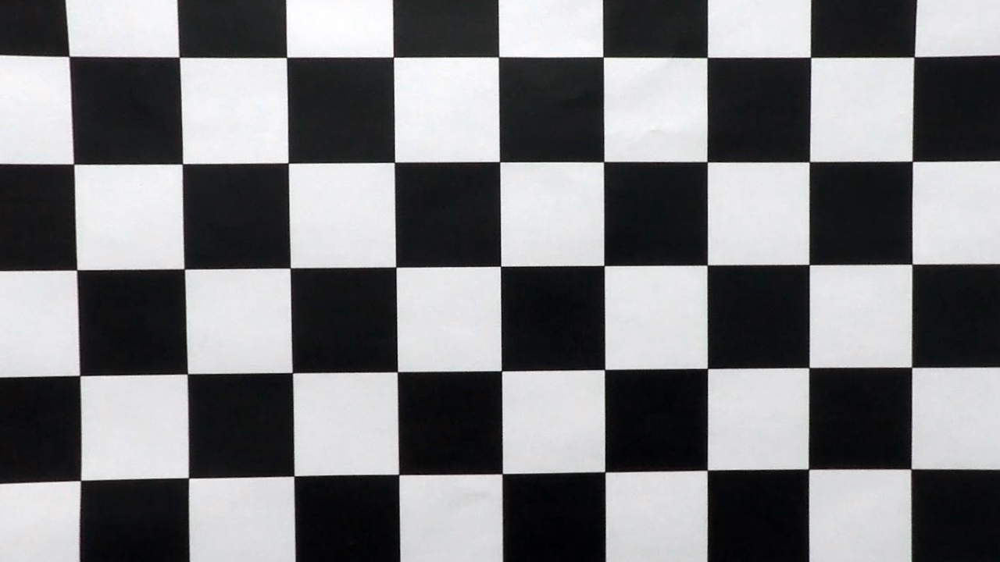
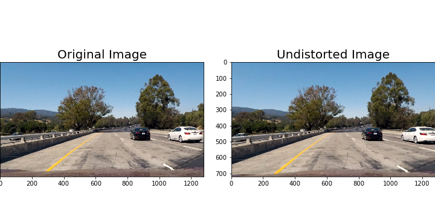
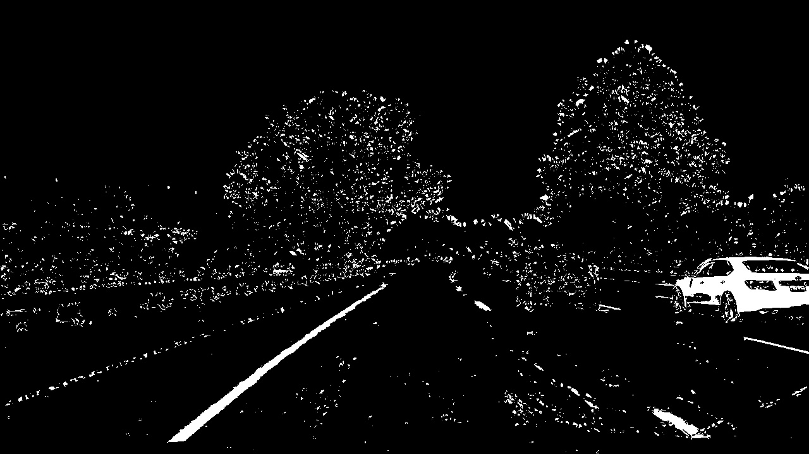
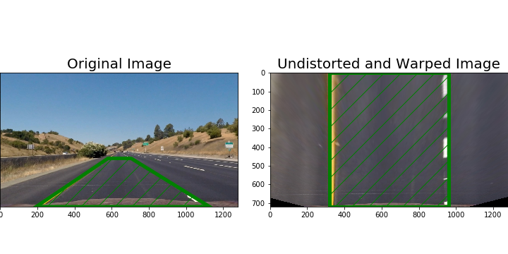
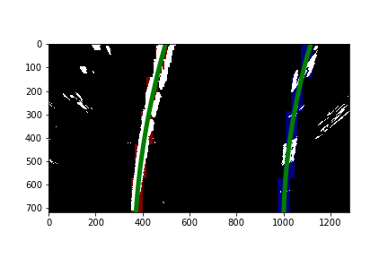
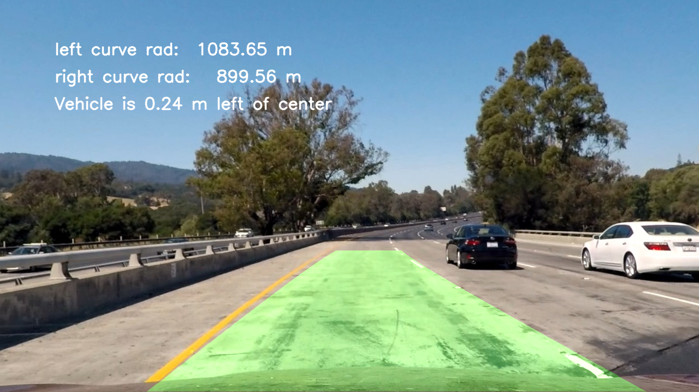

# Term 1 Project 4 - Advanced Lane Finding

The goals of this project is implementing a more robust lane finding pipeline to detect lane lines as well as measuring curvature and position shift.

The steps of this project are the following:
* Compute the camera calibration matrix and distortion coefficients given a set of chessboard images.
* Apply a distortion correction to raw images.
* Use color transforms, gradients, etc., to create a thresholded binary image.
* Apply a perspective transform to rectify binary image ("birds-eye view").
* Detect lane pixels and fit to find the lane boundary.
* Determine the curvature of the lane and vehicle position with respect to center.
* Warp the detected lane boundaries back onto the original image.
* Output visual display of the lane boundaries and numerical estimation of lane curvature and vehicle position.

## [Rubric](https://review.udacity.com/#!/rubrics/571/view) Points
### Camera Calibration

#### 1. Briefly state how you computed the camera matrix and distortion coefficients. Provide an example of a distortion corrected calibration image.

The code for this step is contained in the first section, "Camera Calibration", of the IPython notebook located in "P4.ipynb".

I start by preparing "object points", which will be the (x, y, z) coordinates of the chessboard corners in the world. Here I am assuming the chessboard is fixed on the (x, y) plane at z=0, such that the object points are the same for each calibration image.  Thus, `objp` is just a replicated array of coordinates, and `objpoints` will be appended with a copy of it every time I successfully detect all chessboard corners in a test image.  `imgpoints` will be appended with the (x, y) pixel position of each of the corners in the image plane with each successful chessboard detection.  

I then used the output `objpoints` and `imgpoints` to compute the camera calibration and distortion coefficients using the `cv2.calibrateCamera()` function.  I applied this distortion correction to the test image using the `cv2.undistort()` function and obtained this result: 



### Pipeline (single images)

#### 1. Provide an example of a distortion-corrected image.

The code for this steop is contained in the section 2.1, "Distortion-correction". I first loaded the previously calculated camera matrix and distortion coefficients `mtx` and `dist` by using `pickle` module then using the `cv2.udistort()` function obtained this result:



#### 2. Describe how (and identify where in your code) you used color transforms, gradients or other methods to create a thresholded binary image.  Provide an example of a binary image result.

I used a combination of color and gradient thresholds to generate a binary image.
Gradient thresholds are defined in section 2.2, color thresholds are in section 2.3). A visulization of best values of each thresholds are shown in section 2.4. Section 2.4 shows the output of combined thresholds. Here's an example of my output for this step.



#### 3. Describe how (and identify where in your code) you performed a perspective transform and provide an example of a transformed image.

The code for my perspective transform includes a Wraper class which provided wrap and unwrap functions.  To produce a top-down perspective transform, I chose the hardcode the source and destination points in the following manner:

```python
CAM_IMG_SIZE = (1280, 720)
src = np.float32(
    [[(CAM_IMG_SIZE[0] / 2) - 60, CAM_IMG_SIZE[1] / 2 + 100],
    [((CAM_IMG_SIZE[0] / 6)) - 20, CAM_IMG_SIZE[1]],
    [(CAM_IMG_SIZE[0] * 5 / 6) + 60, CAM_IMG_SIZE[1]],
    [(CAM_IMG_SIZE[0] / 2 + 65), CAM_IMG_SIZE[1] / 2 + 100]])
dst = np.float32(
    [[(CAM_IMG_SIZE[0] * offset_r), 0],
    [(CAM_IMG_SIZE[0] * offset_r), CAM_IMG_SIZE[1]],
    [(CAM_IMG_SIZE[0] * (1 - offset_r)), CAM_IMG_SIZE[1]],
    [(CAM_IMG_SIZE[0] * (1 - offset_r)), 0]])
```

This resulted in the following source and destination points:

| Source        | Destination   | 
|:-------------:|:-------------:| 
| 580, 460      | 320, 0        | 
| 183, 720      | 320, 720      |
| 1127, 720     | 960, 720      |
| 705, 460      | 960, 0        |

I verified that my perspective transform was working as expected by drawing the `src` and `dst` points onto a test images with straight lane lines and its warped counterpart to verify that the lines appear parallel in the warped image.



#### 4. Describe how (and identify where in your code) you identified lane-line pixels and fit their positions with a polynomial?

In section 2.7, I implemented `find_window_centroids` function to find left and right centroids of each lane segments using sliding window algorithm. The I fit left and right centroids with a 2nd order polynomial respectively. Generated fit line are shown as following:



#### 5. Describe how (and identify where in your code) you calculated the radius of curvature of the lane and the position of the vehicle with respect to center.

The formula calculating curvature of the lane can be found in [this wiki](https://en.wikipedia.org/wiki/Radius_of_curvature). The code can be found in section 2.8. 

Here I also covert the curvature which is calculated in pixel back to meters as we know that the lane is about 30 meters long and 3.7 meters wide. Therefore, meters per pixel in y dimension is `30/720` and meters per pixel in x dimension is `3.7/700`.

The shift of car position from center equals to the new center minus true center. Here the true center is always the center of image which is `1280/2` and new center equals `(left_centroid + right_centroid)/2`. The code can be found in section 2.9.

#### 6. Provide an example image of your result plotted back down onto the road such that the lane area is identified clearly.

In section 2.10, I implemented function `produce_output` to plot the detected lane area back down onto the road as well as other measurements. Here is an example of my result on a test image:



---

### Pipeline (video)

#### 1. Provide a link to your final video output.  Your pipeline should perform reasonably well on the entire project video (wobbly lines are ok but no catastrophic failures that would cause the car to drive off the road!).

Here's a [link to my video result](./result.mp4)

---

### Discussion

#### 1. Briefly discuss any problems / issues you faced in your implementation of this project. Where will your pipeline likely fail?  What could you do to make it more robust?

The most important step I found to build a robust lane line detector is generating the thresholded binary image with extracting of most of yellow and white line segments. I tried a large range of combination to achieve the best result among test images. The combination of different types of thresholding with specific values works well for the project video, however, it fails to extract enough line segments from chanllenge videos under extreme light conditions such as vary dark shadows casted by tall pine trees or extra bright washed out window reflection. It is important to find a adaptive approch to set the thresholds for various conditions.

Same problem comes to perspective transform, as right now the transform is based on images of flat grounds. A adaptive approch also needed in order to have a top down view in which left and right lines are as parallel as possible.

When it comes to detect line segments within wrapped binary image, Sliding Window algorithm works relatively well. However, in order to handle to sharp turns which curvature changes dramatically, we may need to increase top number of levels to have a finer detection to small changes. Higher number of levels will introduce errors as more windows will be fitted between gaps of lane line segments. To recover from this problem, we can introduce momentum, as lane line curve tends to have smooth transformation even for sharp ones. We will place next window to place carrying previous momnentum of along the line curve.