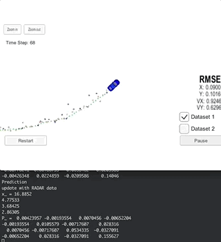

# Term 2 Project 1 - Extended Kalman Filters 

## Overview

In this project I utilize a kalman filter to estimate the state of a moving object of interest with noisy lidar and radar measurements.

This project involves the Term 2 Simulator which can be downloaded [here](https://github.com/udacity/self-driving-car-sim/releases).

This repository includes two files that can be used to set up and install [uWebSocketIO](https://github.com/uWebSockets/uWebSockets) for either Linux or Mac systems. For windows you can use either Docker, VMware, or even [Windows 10 Bash on Ubuntu](https://www.howtogeek.com/249966/how-to-install-and-use-the-linux-bash-shell-on-windows-10/) to install uWebSocketIO.

Once the install for uWebSocketIO is complete, the main program can be built and run by doing the following from the project top directory.

1. mkdir build
2. cd build
3. cmake ..
4. make
5. ./ExtendedKF

Here is the main protcol that main.cpp uses for uWebSocketIO in communicating with the simulator.

INPUT: values provided by the simulator to the c++ program

["sensor_measurement"] => the measurement that the simulator observed (either lidar or radar)

OUTPUT: values provided by the c++ program to the simulator

["estimate_x"] <= kalman filter estimated position x
["estimate_y"] <= kalman filter estimated position y
["rmse_x"]
["rmse_y"]
["rmse_vx"]
["rmse_vy"]

### Generating Additional Data

If you'd like to generate your own radar and lidar data, see the
[utilities repo](https://github.com/udacity/CarND-Mercedes-SF-Utilities) for
Matlab scripts that can generate additional data.

### Other Important Dependencies

* cmake >= 3.5
  * All OSes: [click here for installation instructions](https://cmake.org/install/)
* make >= 4.1 (Linux, Mac), 3.81 (Windows)
  * Linux: make is installed by default on most Linux distros
  * Mac: [install Xcode command line tools to get make](https://developer.apple.com/xcode/features/)
  * Windows: [Click here for installation instructions](http://gnuwin32.sourceforge.net/packages/make.htm)
* gcc/g++ >= 5.4
  * Linux: gcc / g++ is installed by default on most Linux distros
  * Mac: same deal as make - [install Xcode command line tools](https://developer.apple.com/xcode/features/)
  * Windows: recommend using [MinGW](http://www.mingw.org/)

## [Rubric](https://review.udacity.com/#!/rubrics/748/view) Points
### Compiling
#### Your code should compile.
1. Clone this repo.
2. Make a build directory: `mkdir build && cd build`
3. Compile: `cmake .. && make` 
   * On windows, you may need to run: `cmake .. -G "Unix Makefiles" && make`
4. Run it: `./ExtendedKF `

The program executes without errors.

### Accuracy
#### px, py, vx, vy output coordinates must have an RMSE <= [.11, .11, 0.52, 0.52] when using the file: "obj_pose-laser-radar-synthetic-input.txt which is the same data file the simulator uses for Dataset 1"

My EKF accuracy is:

* Dataset 1 RMSE: [0.0973, 0.0855, 0.4513, 0.4399]

### Following the Correct Algorithm
#### Your Sensor Fusion algorithm follows the general processing flow as taught in the preceding lessons.

The Kalman filter implementation can be found [src/kalman_filter.cpp](./src/kalman_filter.cpp) and it is used to predict at [src/FusionEKF.cpp](./src/FusionEKF.cpp#L128) line 128 and to update at line 148 and 155.

#### Your Kalman Filter algorithm handles the first measurements appropriately.

The first measurement is handled at [src/FusionEKF.cpp](./src/FusionEKF.cpp#L78)  from line 78 to line 108.

#### Your Kalman Filter algorithm first predicts then updates.

The predict operation could be found at [src/FusionEKF.cpp](./src/FusionEKF.cpp#L112) line 112 and the update operation could be found at line 131 to 155.

#### Your Kalman Filter can handle radar and lidar measurements.

Two types of measurements are handled in [src/FusionEKF.cpp](./src/FusionEKF.cpp#L141):

- For radar measurement from line 141 to line 148.
- For lidar measurement from line 150 to 155.

### Code Efficiency

#### Your algorithm should avoid unnecessary calculations.

An example of this calculation optimization is when the matrix Q is calculated at [src/kalman_filter.cpp](./src/kalman_filter.cpp#L96) line 96.